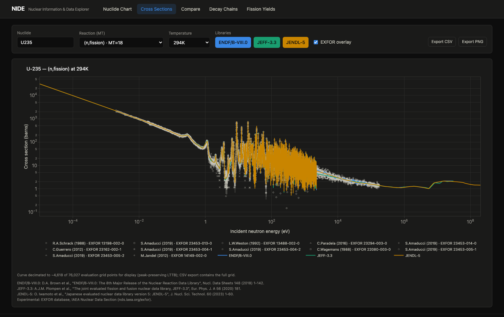
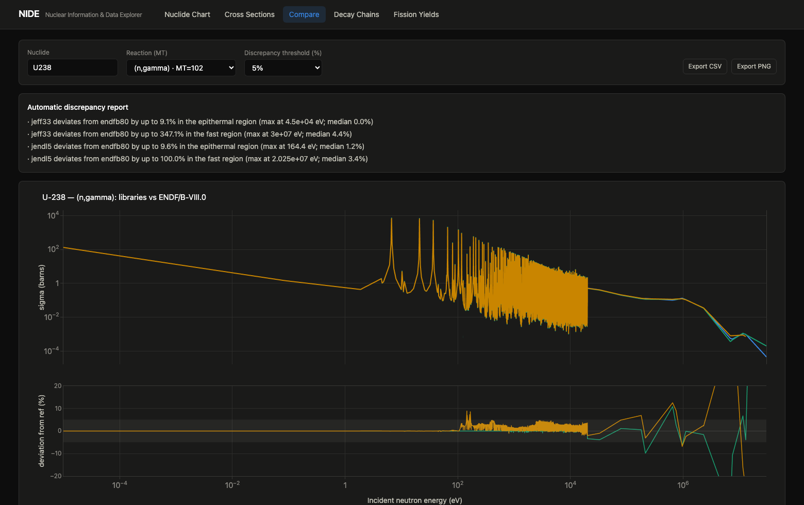
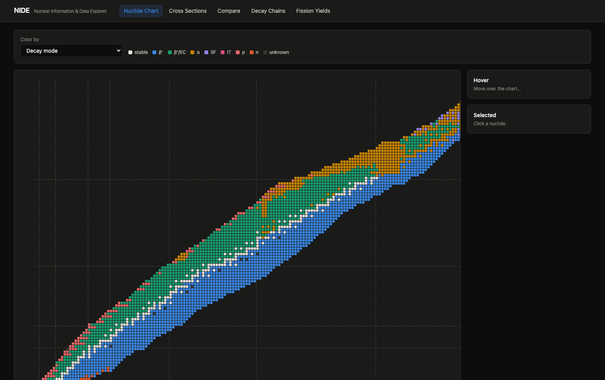
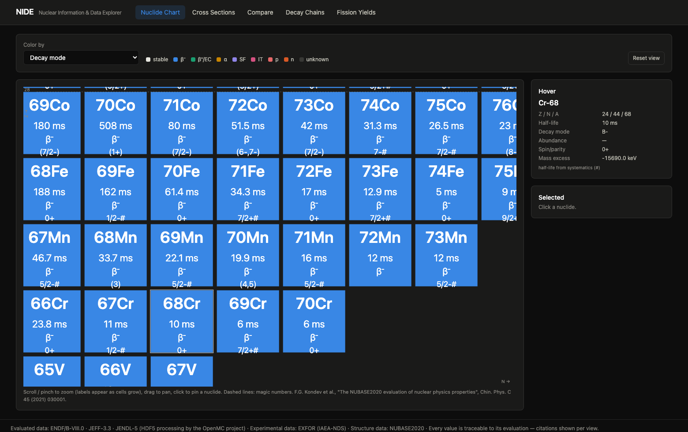
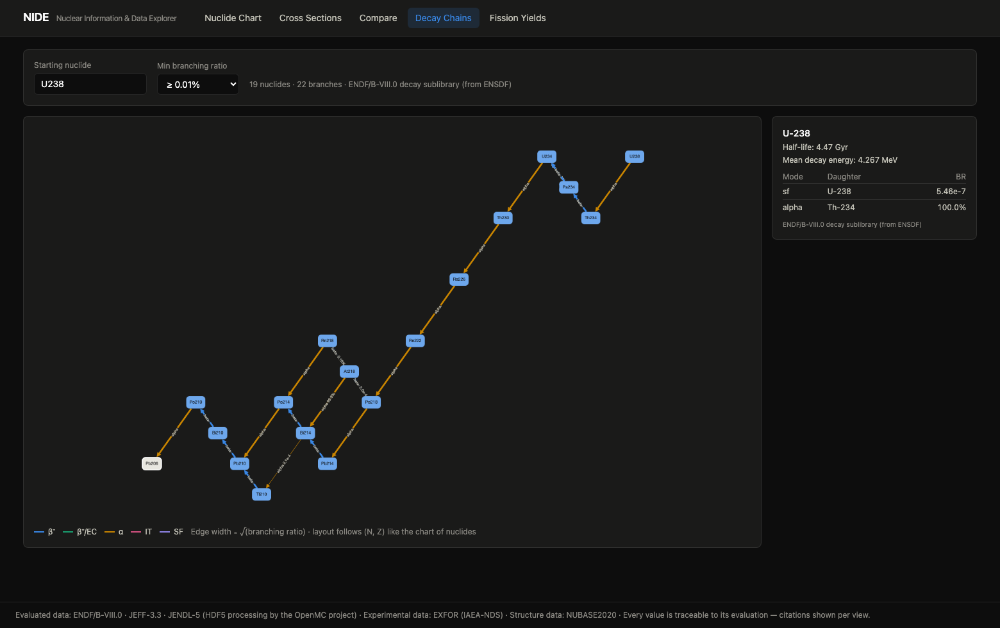
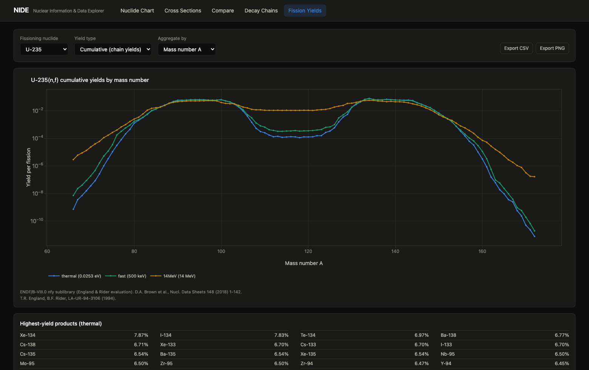

# NIDE — Nuclear Information and Data Explorer

[](LICENSE)
[](https://www.python.org/)
[](https://nodejs.org/)
[](backend/tests/)
[](https://openmc.org/data/)

**A free, local, open-source explorer for evaluated nuclear data, built as a
successor to JANIS.** Browse, visualize and *automatically compare* cross
sections, decay data and fission yields from ENDF/B-VIII.0, JEFF-3.3 and
JENDL-5, with experimental EXFOR data overlaid on every plot. Runs entirely
on your machine: no accounts, no API keys, no cloud.



## Why NIDE exists

For two decades, [JANIS](https://www.oecd-nea.org/janis/) (OECD Nuclear
Energy Agency) has been the tool physicists reach for to look up a cross
section. **Its web service is scheduled for decommissioning in December
2026**, and the desktop version is a closed-source Java application. NIDE
fills that gap with a modern, fully open stack and adds the thing JANIS
never had: an automatic, quantitative comparison engine between evaluations.

Two principles drive the design:

- **Physics you can trust.** All ENDF parsing, resonance reconstruction and
  Doppler-broadened data come from
  [`openmc.data`](https://docs.openmc.org/en/stable/pythonapi/data.html)
  (MIT/Argonne), validated by the international transport community, not a
  home-grown parser. A 72-test suite pins NIDE's numbers to published
  reference values (see [Physics validation](#physics-validation)).
- **Total traceability.** Every plot, table and CSV carries the citation of
  the evaluation it came from. Everything is deterministic: no LLMs, no
  fitting, no magic, just the libraries, compared honestly.

## What you can do with it

- **Cross-section viewer** — interactive log-log σ(E) for any
  nuclide/reaction (ENDF MT) at any library temperature, several libraries
  overlaid, with **EXFOR experimental datasets** on top (author, year and
  EXFOR entry number in the legend, error bars included). Curves are
  decimated for display with a peak-preserving algorithm (LTTB + per-bucket
  extrema), so resonance amplitudes on screen are exact; exports carry the
  full evaluation grid.
- **Multi-library comparison engine** — the differentiator. Interpolates all
  selected libraries onto a common grid (log-log, union of meshes), computes
  point-by-point deviations against a *selectable* reference library, and
  reduces them to statistics per energy region (thermal < 0.625 eV /
  epithermal / fast > 100 keV): median deviation, lethargy-weighted
  threshold coverage, localized maximum. A deterministic, rule-based report
  then classifies each discrepancy as a *narrow resonance-like spike* or a
  *broad systematic band* — e.g. *"jendl5: within 5% of jeff33 over 95.3% of
  the compared range; 359 narrow resonance-like spikes (largest: 81% near
  2246 eV)"*.
- **Derived quantities, with references** — thermal (2200 m/s) value,
  resonance integral (0.5 eV Cd cutoff, Atlas convention), Maxwellian
  spectrum average, Westcott g-factor (strict AECL-1101 definition), and
  Watt fission-spectrum average (ENDF-102 U-235 thermal parameters) —
  computed per library into an automatic comparison table. Every formula is
  documented in the code with its literature source.
- **Interactive chart of nuclides** — all ~3,500 NUBASE2020 ground states on
  a zoomable, pannable canvas with progressive detail (IAEA Live Chart
  style): colors at a distance; mass + symbol as you zoom; half-life, decay
  mode and spin/parity inside the cells at high zoom. Color by decay mode,
  half-life, isotopic abundance, or thermal capture σ. Click any nuclide to
  jump to its cross sections, comparison or decay chain.
- **Decay chains** — directed graphs (Cytoscape.js) from any nuclide down to
  stability, laid out on physical (N, Z) coordinates like the wall charts:
  α steps go down-left, β⁻ up-left. Half-lives on nodes; decay modes and
  branching ratios on edges; branch pruning by branching ratio.
- **Fission product yields** — independent and cumulative yields (thermal /
  fast / 14 MeV) for 31 fissioning systems, aggregated by mass number (the
  classic double-humped curve) or by Z, with the correct chain-yield
  conventions (England & Rider).
- **Publication-ready export** — CSV with full provenance headers (library,
  version, access date, official citation) and PNG figures with citations
  stamped in the footer.

| | |
|---|---|
|  |  |
|  |  |



## Installation

Prerequisites (macOS): Python ≥ 3.11, Node ≥ 20, Homebrew.

```sh
brew install cmake hdf5 node   # build deps for openmc (native arm64)
./setup.sh                     # venv + backend deps + frontend deps (~5 min)
./run.sh                       # first run downloads data, then starts the app
```

Then open http://localhost:5173. The first `./run.sh` downloads
ENDF/B-VIII.0 (~2 GB compressed) plus the small decay / fission-yield /
NUBASE2020 files in the foreground, and JEFF-3.3 + JENDL-5 in the
background — comparison views light up as each library finishes. All data
lands in `backend/data/` (git-ignored; ~30 GB extracted for all three
libraries). Interactive API docs at http://localhost:8000/docs.

> **Linux:** replace the brew line with your distribution's `cmake` and
> HDF5 development packages (e.g. `libhdf5-dev`), or install openmc from
> conda-forge — everything else is identical.

## Python API

NIDE is also a library. The same validated service layer that powers the web
app is exposed as a clean Python package — no server required:

> **Note:** run these examples with the interpreter of the virtual
> environment created by `setup.sh` (`backend/.venv/bin/python`, or activate
> it with `source backend/.venv/bin/activate`) — a global system Python does
> not have `nide` installed and will raise `ModuleNotFoundError`.

```python
from nide import NuclearLibrary, compare

u235 = NuclearLibrary("ENDF/B-VIII.0").nuclide("U235")

xs = u235.cross_section("(n,f)")       # or 18, "n,f", "fission"
xs.at(0.0253)                          # 586.6 (barns, 2200 m/s point)
xs.energy_ev, xs.xs_barns              # full evaluation grid, numpy arrays
xs.citation                            # 'D.A. Brown et al., Nucl. Data Sheets 148 (2018)...'

u235.derived_quantities("capture").resonance_integral_barns

report = compare("U238", "(n,gamma)", ["JEFF-3.3", "ENDF/B-VIII.0"])
print(report.summary)                  # median-led discrepancy report
```

Installed by `setup.sh` (`pip install -e backend`). Typical uses:

- **Research notebooks** — pull evaluated curves and derived quantities
  straight into Jupyter/pandas for analysis alongside your own data, with
  the citation attached to every object (reproducibility for free).
- **Simulation pipelines** — query thermal values, resonance integrals or
  spectrum-averaged cross sections programmatically when generating inputs
  for transport or depletion codes, instead of hand-copying numbers from a
  viewer.
- **Bulk library comparisons** — script `compare()` over hundreds of
  nuclide/reaction pairs to survey where two evaluations disagree beyond a
  tolerance, and export the flagged cases — no browser involved.

## Physics validation

`pytest` runs 72 checks: 25 physics validations against published reference
values (Mughabghab's *Atlas of Neutron Resonances*, NUBASE2020, England &
Rider), downsampling regressions on five nuclides with narrow resonances,
API edge cases, and the Python API. Each test documents its source in
[`backend/tests/`](backend/tests/test_physics_validation.py); a
formula-by-formula audit against the cited references is recorded in
[`AUDIT.md`](AUDIT.md), and architecture decisions in
[`DECISIONS.md`](DECISIONS.md).

| Quantity | NIDE (ENDF/B-VIII.0) | Reference |
|---|---|---|
| σ_f(U-235) at 0.0253 eV | 586.6 b | 584.3 ± 1.0 b (Atlas) |
| σ_γ(U-238) at 0.0253 eV | 2.683 b | 2.683 ± 0.012 b |
| σ_γ(H-1) at 0.0253 eV | 0.3326 b | 0.3326 ± 0.0007 b |
| σ_abs(B-10) at 0.0253 eV | 3845 b | 3844 ± 21 b |
| RI_γ(U-238), Cd cutoff 0.5 eV | 275.0 b | 275 ± 3 b |
| Westcott g_f(U-235), 293.6 K | 0.979 | ~0.977 (AECL-1101) |
| T½(Co-60) | 5.271 yr | 5.2711 yr (NUBASE2020) |
| U-238 decay chain | reaches stable Pb-206 | 4n+2 series |
| Y_cum(Cs-137), U-235 thermal | 6.19 % | 6.19 % (England & Rider) |

```sh
cd backend && .venv/bin/python -m pytest tests -q
```

## Data sources (all official, all free)

| Source | Used for |
|---|---|
| [openmc.org/data](https://openmc.org/data/) | ENDF/B-VIII.0, JEFF-3.3, JENDL-5 processed to HDF5 (NJOY) |
| [NNDC, Brookhaven](https://www.nndc.bnl.gov/endf-b8.0/) | ENDF/B-VIII.0 decay and fission-yield sublibraries (ENDF-6) |
| [IAEA-NDS EXFOR](https://nds.iaea.org/exfor/) (Data Explorer API) | Experimental cross-section datasets |
| [IAEA AMDC](https://www-nds.iaea.org/amdc/) | NUBASE2020 ground-state properties |

`backend/scripts/download_data.py` fetches everything; downloads are
resumable and verified against a `cross_sections.xml` manifest.

## Architecture

```
backend/   Python 3.11+ · FastAPI · openmc.data
  app/core/         library_manager, xs_service (disk cache + peak-preserving
                    LTTB), comparison_engine ★, derived_quantities ★,
                    decay_service, fission_yields, exfor_client,
                    nuclide_properties
  app/api/routes/   REST endpoints (OpenAPI/Swagger at :8000/docs)
  nide/             public Python API (facade over app/core)
  scripts/          download_data.py
  tests/            physics validation, downsampling, edge cases, API
frontend/  React 19 · Vite · Tailwind · Plotly.js · Cytoscape.js
  src/components/   NuclideChart, XSViewer, ComparisonPanel,
                    DecayChainGraph, FissionYieldsView, ExportDialog
```

Design notes worth knowing: extracted curves are cached on disk (`.npz`) so
HDF5 is parsed once per nuclide/reaction; display decimation is LTTB in
log-log space augmented with per-bucket extrema so resonance peaks and
interference dips survive exactly; EXFOR responses are cached indefinitely
(experimental data is immutable) and the app degrades gracefully when the
IAEA API is unreachable; nothing in the runtime calls an LLM or any paid
service.

## Contributing

Issues and pull requests are welcome. The bar for physics changes: every
formula carries its literature reference in the docstring, and
`backend/tests/` must pass — add a pinned reference value for anything new.
Code style: `ruff` (backend), NumPy-style docstrings, explicit units in
names or docstrings (eV, barns, seconds).

## Data citations

- **ENDF/B-VIII.0** — D.A. Brown et al., *Nucl. Data Sheets* **148** (2018) 1-142.
- **JEFF-3.3** — A.J.M. Plompen et al., *Eur. Phys. J. A* **56** (2020) 181.
- **JENDL-5** — O. Iwamoto et al., *J. Nucl. Sci. Technol.* **60** (2023) 1-60.
- **EXFOR** — N. Otuka et al., *Nucl. Data Sheets* **120** (2014) 272-276.
- **NUBASE2020** — F.G. Kondev et al., *Chin. Phys. C* **45** (2021) 030001.
- **Fission yields** — T.R. England, B.F. Rider, LA-UR-94-3106 (1994).
- **HDF5 processing / openmc** — P.K. Romano et al., *Ann. Nucl. Energy* **82** (2015) 90-97.

## License

MIT (see [LICENSE](LICENSE)). The nuclear data libraries themselves are
distributed by their respective evaluation projects under their own terms.
